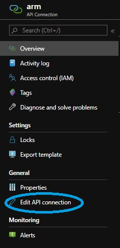
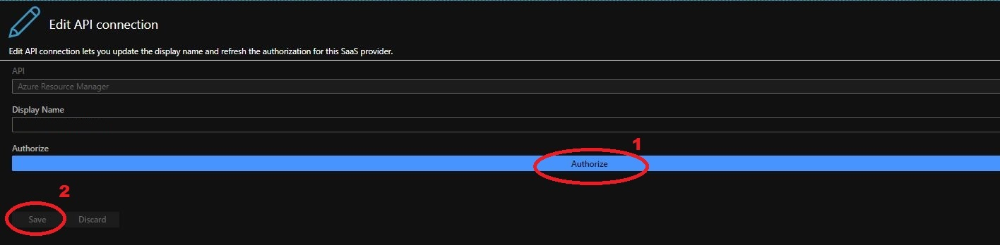

# Clinical Trials Matching Service Blueprint

## Requirements

Clone this repository to your local drive

```Powershell
git clone https://github.com/microsoft/ClinicalTrialsBlueprint
cd ClinicalTrialsBlueprint
```

[Install the Azure PowerShell module](https://docs.microsoft.com/en-us/powershell/azure/install-az-ps?view=azps-3.3.0)

## Connect to Azure Subscription

```PowerShell
Login-AzAccount
$account = Set-AzContext -Subscription <Your Subscription Name>
```
## Fill Parameters
Assign a name for the matching service
```Powershell
$ctmServiceName = "<ctm matching service>"
```
also fill the parameter files with missing parameters and chosen service same as $ctmServiceName
```Powershell
.\arm-templates\azuredeploy-fhir.parameters.json
.\arm-templates\azuredeploy-logicapps.parameters.json
.\arm-templates\azuredeploy-ctm.parameters.json
```
## Setup the FHIR Server

Create Resource Group that will contain all the resources required for the blueprint resources

```PowerShell
$ctmRg = New-AzResourceGroup -Name <resources group name> -Location eastus
```

Create the FHIR server deployment. You will to provide a admin password for the SQL server

```PowerShell
New-AzResourceGroupDeployment -ResourceGroupName $ctmRg.ResourceGroupName `
                              -TemplateFile .\arm-templates\azuredeploy-fhir.json `
                              -TemplateParameterFile .\arm-templates\azuredeploy-fhir.parameters.json 
                              
```

Create secondary FHIR server

```PowerShell
New-AzResourceGroupDeployment -ResourceGroupName $ctmRg.ResourceGroupName `
                              -TemplateFile .\arm-templates\azuredeploy-fhir.json `
                              -TemplateParameterFile .\arm-templates\azuredeploy-fhir.parameters.json `
                              -isSecondary $true
```

Verify that the FHIR Server is running

```PowerShell
$metadataUrl = "https://$ctmServiceName-fhir.azurewebsites.net/metadata" 
$metadata = Invoke-WebRequest -Uri $metadataUrl
$metadata.RawContent
```

It will take a minute or so for the server to respond the first time.

## Setup the Matching service

Create Logic Applications to manage automatic restructuring

```Powershell
$logicAppsOutput = New-AzResourceGroupDeployment -ResourceGroupName $ctmRg.ResourceGroupName `
                  -TemplateFile .\arm-templates\azuredeploy-logicapps.json `
                  -TemplateParameterFile .\arm-templates\azuredeploy-logicapps.parameters.json `
                  -accountId (Get-AzContext).Account.Id
```

Open resource group in azure portal and authorize 2 API connections (arm and office365)




Create Primary Clinical Trials Matching service Azure resources

```Powershell
$matchingOutput = New-AzResourceGroupDeployment -ResourceGroupName $ctmRg.ResourceGroupName `
                  -TemplateFile .\arm-templates\azuredeploy-ctm.json `
                  -TemplateParameterFile .\arm-templates\azuredeploy-ctm.parameters.json 
```

Stopping primary structuring instance 

```Powershell
. .\scripts\structuring.ps1
```

```Powershell
Stop-CtmStructuring -resourceGroupName $ctmRg.ResourceGroupName -containerGroupName $matchingOutput.Outputs.structuringName.Value
```

Create Secondary Clinical Trials Matching service that will be used as the primary service is being serviced. You need only to pass isSecondary parameter as true

```Powershell
$matchingSecondaryOutput = New-AzResourceGroupDeployment -ResourceGroupName $ctmRg.ResourceGroupName `
                          -TemplateFile .\arm-templates\azuredeploy-ctm.json `
                          -TemplateParameterFile .\arm-templates\azuredeploy-ctm.parameters.json `
                          -isSecondary $true 
                
```

Check that the TextAnalytics for Healthcare service is running and ready

```PowerShell
$taReadyUrl = $matchingOutput.Outputs.gatewayEndpoint.Value + "/ta4h/ready"
$taReadyResponse = Invoke-WebRequest -Uri $taReadyUrl
$taReadyResponse.RawContent
```

Check that the Query Engine Service is running

```PowerShell
$queryUrl = $matchingOutput.Outputs.gatewayEndpoint.Value + "/qe"
$queryResponse = Invoke-WebRequest -Uri $queryUrl
$queryResponse.RawContent
```

Check that the Disqualification Engine Service is running

```PowerShell
$disqualificationUrl = $matchingOutput.Outputs.gatewayEndpoint.Value + "/disq"
$disqualificationResponse = Invoke-WebRequest -Uri $disqualificationUrl
$disqualificationResponse.RawContent
```

### Restrict Access to service

```Powershell
. .\scripts\restrictAccess.ps1
```

```PowerShell
Add-CTMRestrictIPs -resourceGroupName $ctmRg.ResourceGroupName -serviceName $ctmServiceName
```

### Setup the Healthcare Bot Service

Assign the Healthcare Bot service name 

```PowerShell
$botServiceName = "<healthcare bot service>"
$secondaryBotServiceName = "<secondary healthcare bot service>"
```

Load the marketplace script

```PowerShell
. .\scripts\marketplace.ps1
```

Create the Healthcare primary and secondary bots Azure Marketplace SaaS Application

```PowerShell
$saasSubscriptionId =  New-HbsSaaSApplication -name $botServiceName -planId free
$secondarySaaSSubscriptionId =  New-HbsSaaSApplication -name $secondaryBotServiceName -planId free
```

You can also see all your existing SaaS applications by running this command. 

```PowerShell
Get-HbsSaaSApplication
```

Deploy a primary Healthcare Bot resources for the Marketplace SaaS application you just created or already had before.

```PowerShell
.\scripts\azuredeploy-healthcarebot.ps1 -ResourceGroup $ctmRg.ResourceGroupName `
                -saasSubscriptionId $saasSubscriptionId  -botServiceName $botServiceName `
                -botLocation US -matchingOutput $matchingOutput `
                -TemplateParameterFile .\arm-templates\azuredeploy-healthcarebot.parameters.json `
```

You can now deploy a secondary Healthcare bot and functional testing webapp by running this command

```PowerShell
.\scripts\azuredeploy-healthcarebot.ps1 -ResourceGroup $ctmRg.ResourceGroupName `
                -saasSubscriptionId $secondarySaaSSubscriptionId  `
                -botServiceName $secondaryBotServiceName `
                -botLocation US -matchingOutput $matchingSecondaryOutput `
                -TemplateParameterFile .\arm-templates\azuredeploy-healthcarebot.parameters.json `
                -isSecondary $true
```

To view a Power BI report of your primary Healthcare Bot usage:
 * First you need to open the bot's application insights (should be '$botServiceName-insights') and obtain the application_id in insight's 'API Access' tab.
 * Open the report file under 'power-bi/CTM_PowerBI_report.pbit' and provide the application_id obtained in previous step.  


### Configuration Change

When it's necessary to change the configuration of the matching services,
Update the parameters file
```Powershell
.\arm-templates\azuredeploy-ctm.parameters.json
```
With the wanted configuration and run the following

```Powershell
. .\scripts\config-change.ps1
ChangeConfig -resourceGroupName <resource group name> -serviceName <service name>
```

Notice that, a configuration change will not be permited if a Structuring process is running.
